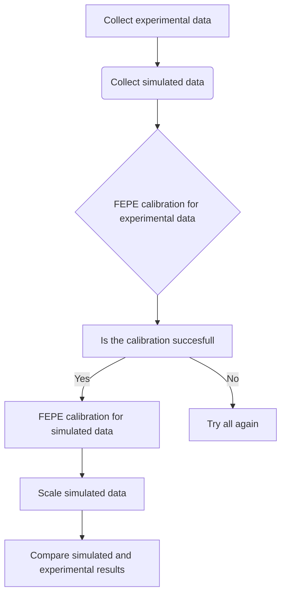

# HPGe detector Calibration and Data Analysis

This repository contains the GEANT4 applications built, experimental data, and jupyter notebooks employed for the data analysis.

**Table of Contents**
* **e_results folder**: has the experimental data for detector calibration.

* **s_results folder**: has the experimental data for detector calibration obtained from the GEANT4 application.

* **hpge_data_treat.ipynb** is the data treatment, data analisis, and data visualization of the results.

* **d_funciones.py** has functions and classes used to modularize the code.

### Data 

----
- The experimental data come from several experiments done in the Nuclear Science Department at Escuela Politécnica Nacional, Quito - Ecuador.
- The simulated data come from simulations run on the GEANT4 application. 
### HPGe detector
---
**1. What is a HPGe detector?**
A HPGe detector is a Hyper Pure Germanium Detector. This kind of detector is used in gamma spectroscopy to identify different isotopes in a sample. 

**2. How is calibrated an HPGe detector?**
The HPGe detector is calibrated through standars with a known activity. It is counted how many particles is the detector able to register effectively. 
The calibration is done with the Full Energy Peak Efficiency (FEPE). 

$$ FEPE = \frac{AP}{E*P} $$

Where:
- AP: is the area of a photopeak for a energy window
- E: is the activity of the radioactive source
- P: is the probability of the emission

How a HPGe detector looks like:

                
### FlowChart of the Data Treatment
---

### Contacts:
---
- [Twitter](https://twitter.com/sarasti_seb)
- [LinkedIn](https://linkedin.com/in/sebastiansarasti)
- [ResearchGate](https://www.researchgate.net/profile/Sebastian-Sarasti-2)
